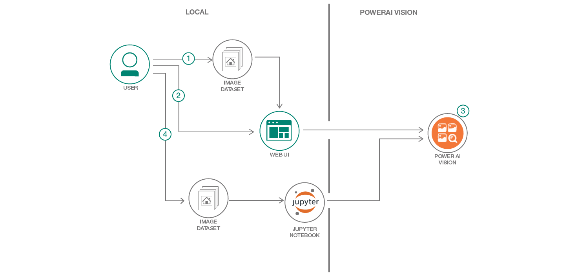
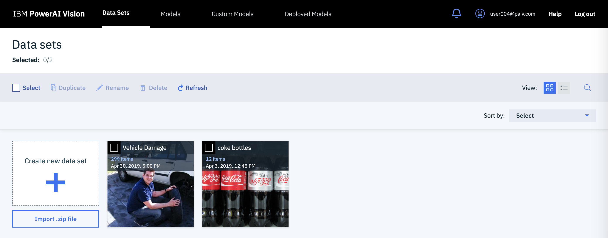
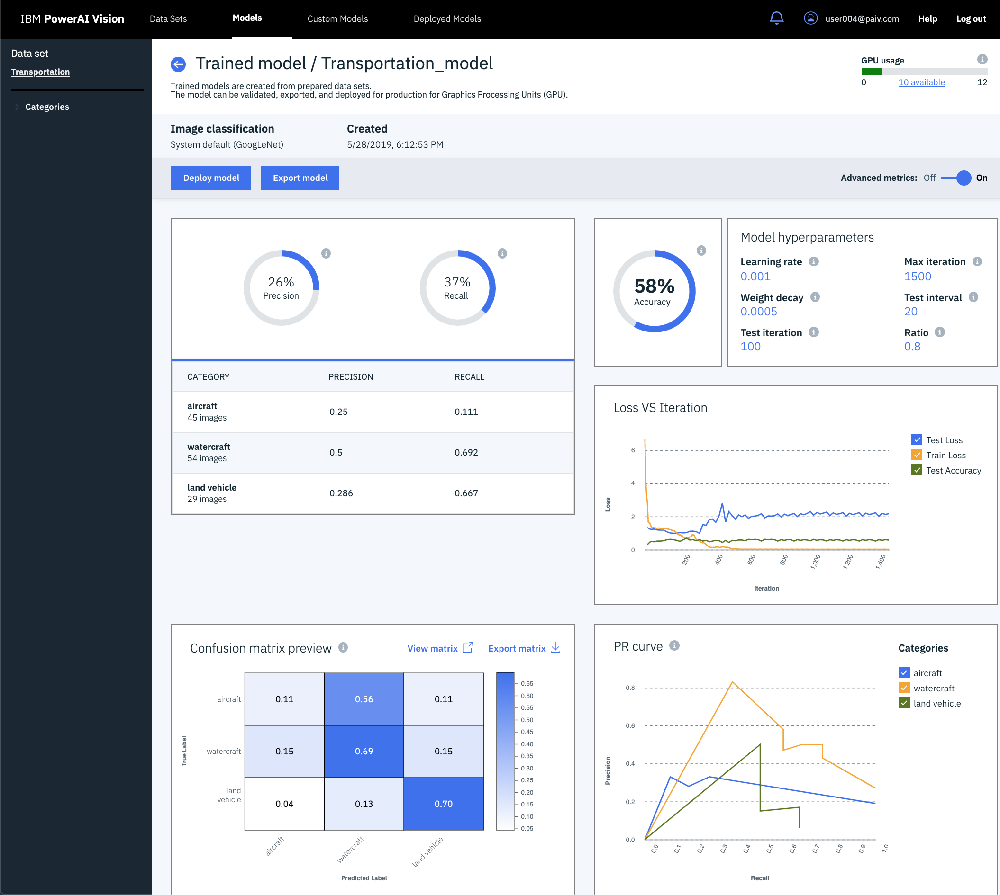
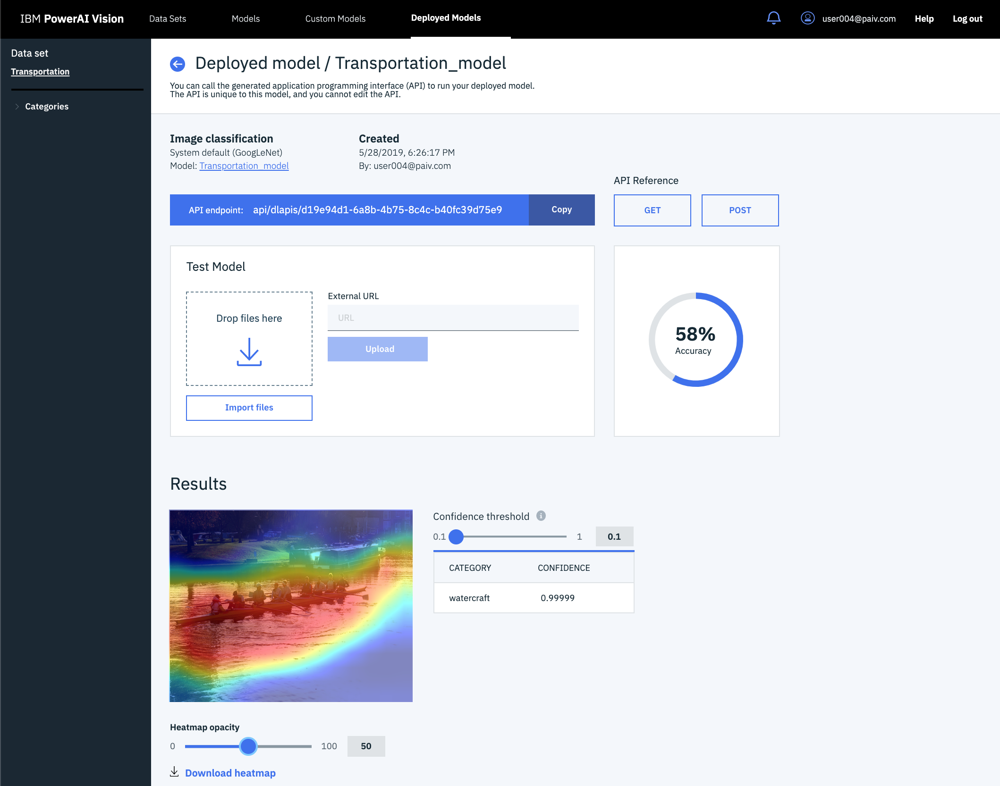
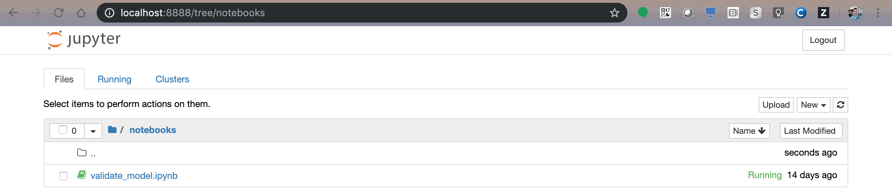
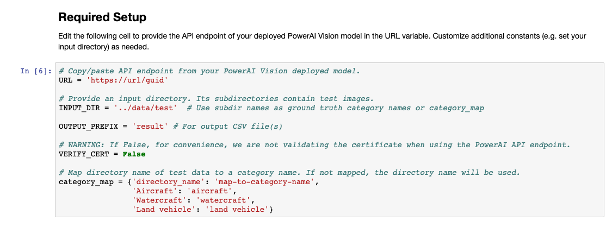
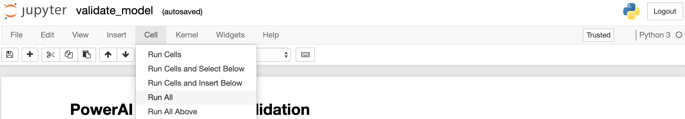
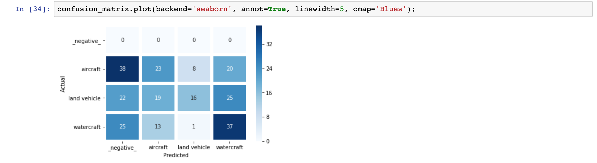
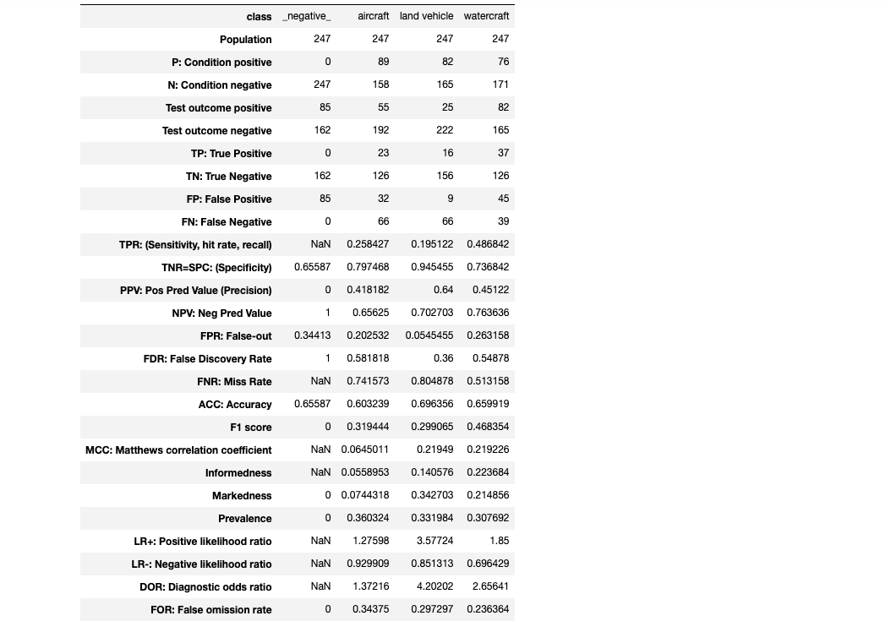
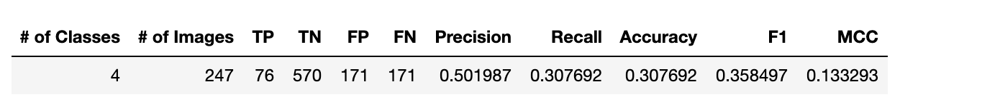

# Computer vision model validation

In this code pattern, we will evaluate an image classification model using a Jupyter notebook. Our model is deployed with PowerAI Vision for inference via a REST API endpoint. We'll use a collection of images that have already been classified as our "ground truth" and see how the inference results compare to the ground truth.

The Jupyter notebook output provides graphical and tabular output.  In addition, the statistics are saved as CSV files for use with other tools or reports. A variety of common model evaluation statistics are produced to represent the accuracy of the model based on this test.

With PowerAI Vision, trained models include testing and accuracy information, but there is often a desire to continue to validate with new test images. The code provided here, allows an external dataset, with known ground truth values, to be evaluated. You can run the provided Jupyter notebook with your own ground truth images and your own deployed model.

When you have completed this code pattern, you will understand how to:

* Classify images with Python and PowerAI Vision
* Run a Jupyter notebook
* Use a variety of measures to evaluate the accuracy of a model



## Flow

1. Create a data set
2. Train a model for image classification
3. Deploy it to a REST API endpoint
4. Validate the model with new data


## Prerequisites

### PowerAI Vision

This code pattern requires PowerAI Vision.
Go [here](https://developer.ibm.com/linuxonpower/deep-learning-powerai/vision/)
to learn more about trial access (when available).

*This code pattern has been updated with screenshots and instructions for IBM PowerAI Vision 1.1.3.*

### Jupyter Notebooks

The code included in this code pattern runs in a Jupyter Notebook. The notebook itself does not require PowerAI or Power Systems (only access to the deployed API). To run the Jupyter Notebook locally, install it using Anaconda.  The installation instructions are [here](https://jupyter.readthedocs.io/en/latest/install.html).

## Steps

1. [Clone the repo](#1-clone-the-repo)
2. [Login to PowerAI Vision](#2-login-to-powerai-vision)
3. [Create a data set](#3-create-a-data-set)
4. [Assign categories to images](#4-assign-categories-to-images)
5. [Train the model](#5-train-the-model)
6. [Deploy and test](#6-deploy-and-test)
7. [Run the notebook](#7-run-the-notebook)
8. [Analyze the results](#8-analyze-the-results)

### 1. Clone the repo

Clone the `powerai-vision-model-validation` repo locally. In a terminal, run:

```bash
git clone https://github.com/IBM/powerai-vision-model-validation
```

### 2. Login to PowerAI Vision

Use your browser to access the PowerAI Vision web UI for steps 3-6.

### 3. Create a data set

> Note: You can use the data set included in the repo or use your own.

To create a new data set:

* Use the `Data Sets` tab and click on the `Create new data set` card.

  

* Provide a data set name and click `Create`. A new data set card will appear. Click on the new card.

### 4. Assign categories to images

To train an image classification model, you must have at least two categories. Each category must have at least five images.

Assign your first category:

* Upload one or more images using drag-and-drop or `Import file`. You can use `data/train/watercraft.zip` from your cloned repo to upload many watercraft images at once.
* Check the `Select` checkbox to select all the images.
* Click on `Assign category` and create and `Assign` a watercraft category.

Repeat to upload `aircraft.zip` and `land_vehicles.zip` and assign categories for each.

> NOTE: Use the categories pull-down section in the left sidebar to select `Uncategorized` images. This makes it easy for you to import a zip and assign a label to all those new images (e.g. aircraft) and then do it again with the next zip file and new category (e.g. land vehicles).

### 5. Train the model

With your categorized training images and a few more clicks, PowerAI Vision will use deep learning models to create a custom model to do image classification based on the data set you provided.

* Click the `Train model` button.
* Ensure that `Image classification` is selected.
* Select the default model (or explore your options).
* Click on `Advanced options` to see some additional parameters. This is where you would adjust some settings if you want to speed up training (for a quick test). Advanced users may use these settings to try to improve the accuracy of the model.
* Click `Train`.

During training, your dataset will be divided so that the model-in-training can be trained, tested, and validated.
When the training is complete, you will see some graphics that show the quality of the resulting model based on this validation.


  
Notice the presentation of `Accuracy`, `Precision`, `Recall`, and the `Confusion Matrix`.

### 6. Deploy and test

After training is complete, there is a convenient `Deploy model` button. You can also deploy a model later as follows.

* Click on the `Models` tab.
* Select the model you want to deploy.
* Click `Deploy model` and then `Deploy`.
* Click on the `Deployed Models` tab. Wait for the model status to show "Ready" and then click on the row.
* Here you can copy the API endpoint. Click `Copy` and save the endpoint to use later in the Jupyter notebook.
* With the PowerAI Vision UI, you can also test the model. Use the `Import files` button (or drag-and-drop) to test the model with an image file.



Notice the results. In addition to a result category and confidence, you will see the image with an overlay heat map. The heat map shows you what part of the image influenced the classification the most. This can be used to help identify when a classifier is trained to recognize the wrong parts of images and needs a better set of training images.

### 7. Run the notebook

The code included in this code pattern runs in a Jupyter Notebook. After you configure the URL of your deployed model in the notebook, you can just run it, read it, and watch the results.

* Start your Jupyter Notebooks. Starting in your `powerai-vision-model-validation` cloned repo directory will help you find the notebook and the output as described below. Jupyter Notebooks will open in your browser.

   ```bash
   cd powerai-vision-model-validation
   jupyter notebook
   ```

* Navigate to the `notebooks` directory and open the notebook file named `validate_model.ipynb` by clicking on it.

  

* Edit the cell below **Required setup!** to replace the `URL` with the API endpoint of your deployed model. Use the copy button to capture the whole URL.

  

* Also edit `INPUT_DIR` in **Required setup!** (see above) if you want to use images in a location other than the default (../data/test). The sub-directory names will be used as the ground truth category names unless there is a mapping in `category_map`.

* Use the drop-down menu `Cell > Run All` to run the notebook, or run the cells one at a time top-down using the play button.

  

* As the cells run, watch the output for results or errors. A running cell will have a label like `In [*]`. A completed cell will have a run sequence number instead of the asterisk.

* The inference call is one line of Python code which posts and image file to the API endpoint URL. The rest of the code is just looping through the images, collecting the results, and producing the statistics.

  ```python
  rsp = requests.post(URL, verify=False, auth=None, files=files)
  ```

### 8. Analyze the results

#### Confusion matrix

A confusion matrix is often the best way to visualize the accuracy of a model. Depending on your use case, you might care more about false positives or false negatives. The confusion matrix gives you a good picture of which categories may be mistaken for others. The notebook shows one matrix with the image counts and another that is normalized and may be a better representation for imbalanced categories.



#### Category statistics

For each category, we can aggregate the counts, positives, and negatives and then produce a variety of statistics. Depending on your use case, the best measure of "accuracy" for a model may be one or more of: sensitivity (recall), precision, accuracy, Mathews correlation coefficient (MCC), or F1 score.

The category statics are written to a CSV file to be convenient for other reports and then are presented (and transposed) in the notebook.



#### Overall statistics

To get an overall evaluation of the model across all categories, you can aggregate some of the statistics. The notebook aggregates the most popular statistics and also stores them in a CSV file.



## Sample output

As the notebook cells run, check for errors and watch the progress indicators.

Example notebook with static output: [here](examples/validate_model.ipynb)

## License

This code pattern is licensed under the Apache License, Version 2. Separate third-party code objects invoked within this code pattern are licensed by their respective providers pursuant to their own separate licenses. Contributions are subject to the [Developer Certificate of Origin, Version 1.1](https://developercertificate.org/) and the [Apache License, Version 2](https://www.apache.org/licenses/LICENSE-2.0.txt).

[Apache License FAQ](https://www.apache.org/foundation/license-faq.html#WhatDoesItMEAN)
